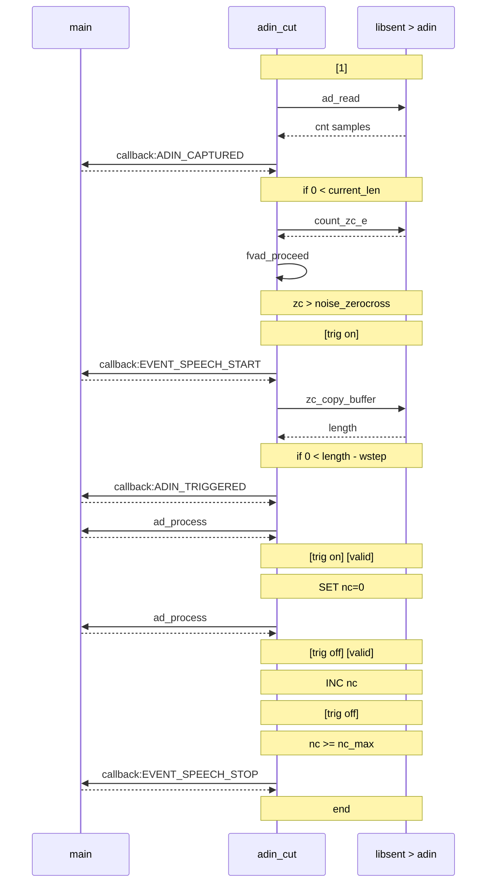

```mermaid
sequenceDiagram
    participant main
    participant adin_cut
    participant ladin as libsent #gt; adin
    Note over adin_cut,ladin: [1]
    adin_cut ->> ladin : ad_read
    ladin -->> adin_cut : cnt samples
    adin_cut ->> main : callback:ADIN_CAPTURED
    main -->> adin_cut :
    Note over adin_cut,ladin: if 0 < current_len
    adin_cut ->> ladin : count_zc_e
    ladin -->> adin_cut :
    adin_cut ->> adin_cut : fvad_proceed
    Note over adin_cut,ladin: zc > noise_zerocross
    Note over adin_cut,ladin: [trig on]
    adin_cut ->> main : callback:EVENT_SPEECH_START
    main -->> adin_cut :
    adin_cut ->> ladin : zc_copy_buffer
    ladin -->> adin_cut : length
    Note over adin_cut,ladin: if 0 < length - wstep
    adin_cut ->> main : callback:ADIN_TRIGGERED
    main -->> adin_cut :
    adin_cut ->> main : ad_process
    main -->> adin_cut :
    Note over adin_cut,ladin: [trig on] [valid]
    Note over adin_cut,ladin: SET nc=0
    adin_cut ->> main : ad_process
    main -->> adin_cut :
    Note over adin_cut,ladin: [trig off] [valid]
    Note over adin_cut,ladin: INC nc
    Note over adin_cut,ladin: [trig off]
    Note over adin_cut,ladin: nc >= nc_max
    adin_cut ->> main : callback:EVENT_SPEECH_STOP
    main -->> adin_cut :
    Note over adin_cut,ladin: end
```
